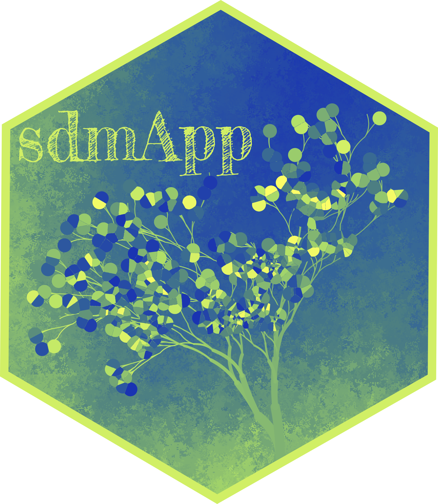
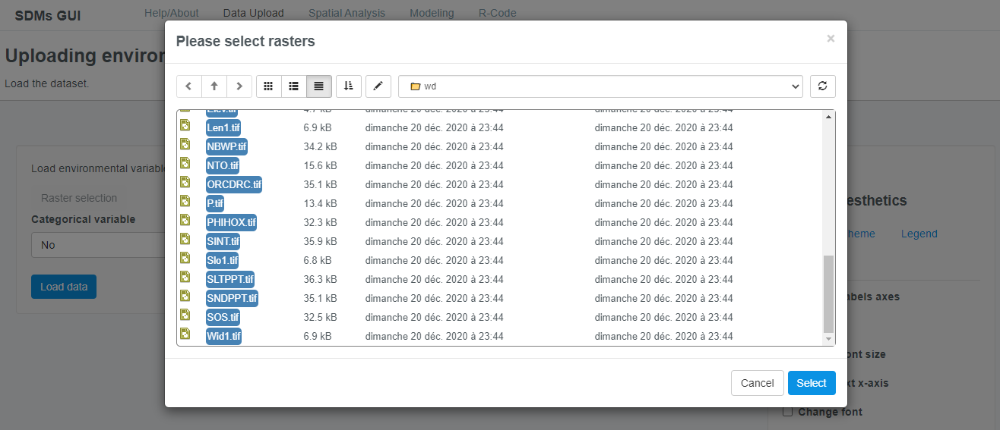
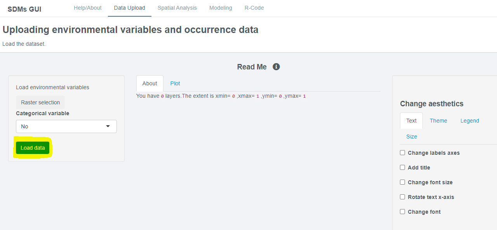
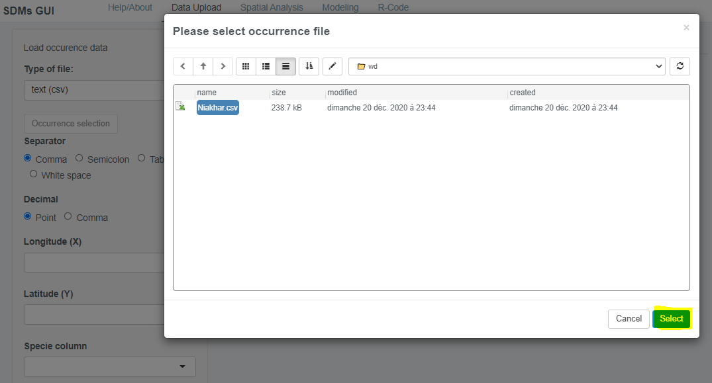
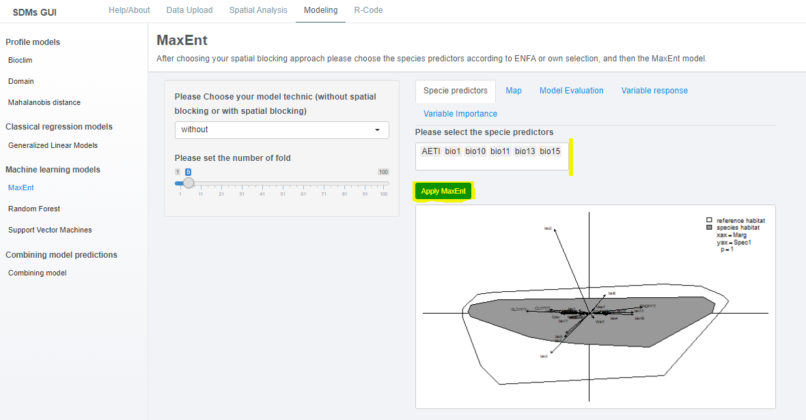

# sdmApp 
 Species Distribution Models Application


# `sdmApp`: Statistical Details

| Package                                                                                                                                                         | Status                                                                                                                                                                                       | Usage                                                                                                                                             | GitHub                                                                                                                                                         | Miscellaneous                                                                                                                                                   |
  |-----------------------------------------------------------------------------------------------------------------------------------------------------------------|----------------------------------------------------------------------------------------------------------------------------------------------------------------------------------------------|---------------------------------------------------------------------------------------------------------------------------------------------------|----------------------------------------------------------------------------------------------------------------------------------------------------------------|-----------------------------------------------------------------------------------------------------------------------------------------------------------------|
  | [](https://CRAN.R-project.org/package=sdmApp)                                 | [](https://travis-ci.org/Abson-dev/sdmApp)                                               | [](https://CRAN.R-project.org/package=sdmApp)     | [](https://github.com/Abson-dev/sdmApp/)               | [](https://Abson-dev.github.io/sdmApp/)                          |
  | [](https://cran.r-project.org/web/checks/check_results_sdmApp.html)                      | [](https://ci.appveyor.com/project/Abson-dev/sdmApp) | [](https://CRAN.R-project.org/package=sdmApp)   | [](https://github.com/Abson-dev/sdmApp/)                                                    | [](https://cran.r-project.org/)                                                      |
  | [](https://lifecycle.r-lib.org/articles/stages.html)                                                  | [](https://github.com/Abson-dev/sdmApp)                                            | [](https://CRAN.R-project.org/package=sdmApp) | [](https://github.com/Abson-dev/sdmApp/issues)                                       | [](https://github.com/Abson-dev/sdmApp)                   |
  | [](https://github.com/Abson-dev/sdmApp) | [](https://coveralls.io/github/Abson-dev/sdmApp?branch=master)             | [](https://CRAN.R-project.org/package=sdmApp)  | [](https://github.com/Abson-dev/sdmApp) | [](https://doi.org/https://doi.org/10.1016/j.ecolind.2021.107481)                                                       |
  | [](https://www.gnu.org/licenses/gpl-3.0.en.html)                                                | [](https://codecov.io/gh/Abson-dev/sdmApp?branch=master)                   | [](https://hits.dwyl.com/Abson-dev/sdmApp)                             | [](https://github.com/Abson-dev/sdmApp/commits/master)    | [](https://github.com/Abson-dev/sdmApp/commits/master) |
  | [](https://CRAN.R-project.org/package=sdmApp)                                                    | [](https://github.com/Abson-dev/sdmApp)                                                            | [](https://github.com/Abson-dev/sdmApp)                                           | [](https://www.repostatus.org/#active)                                                   | [](https://github.com/Abson-dev/sdmApp/issues) |


*sdmApp* is a *R package* containing a *Shiny* application that allows non-expert *R* users to easily model species distribution. It offers a reproducible work flow for species distribution modeling into a single and user friendly environment. *sdmApp* takes *Raster* data (in format supported by the *Raster package*) and species occurrence data (several format supported) as input argument. This *package* provides an interactive graphical user interface (GUI).
 This document will give an overview of the main functionalities of the graphical user interface. The main features of the *GUI* is:

* Uploading data (*raster* and species occurrence files)
* View correlation between *raster*
* Use [CENFA](https://CRAN.R-project.org/package=CENFA) to select species predictors
* Apply a spatial blocking for cross-validation based on the [blockCV](https://CRAN.R-project.org/package=blockCV) package
* Apply species distribution models with or without a spatial blocking strategy 

* Export results
* Keep reproduce (*R* code) by being able do download the underlying code from *sdmApp*.

 The *GUI* is build around 5 main windows, which can be selected from the navigation bar at the top of the screen. Initially, some of these windows will be empty and their content changes once data (both *raster* and species occurrence files) have been uploaded.
 
 
 ## Installation
To install the *package* from *github* use:

```r
remotes::install_github("Abson-dev/sdmApp", dependencies = TRUE)
library(sdmApp)
sdmApp()
```












## License

The *sdmApp* sticker was made through *R* art kindly shared by this [link](https://art.djnavarro.net/) and released under a [CC-BY-SA 4.0](https://www.donneesquebec.ca/licence/) license.
