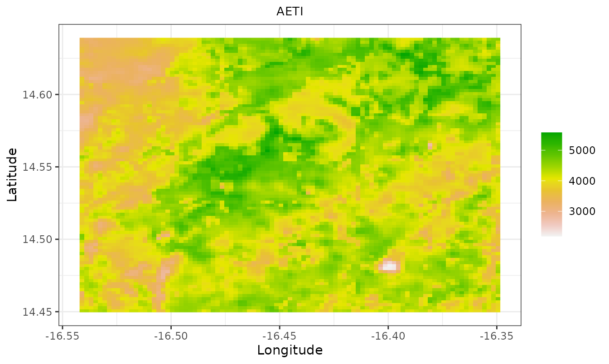
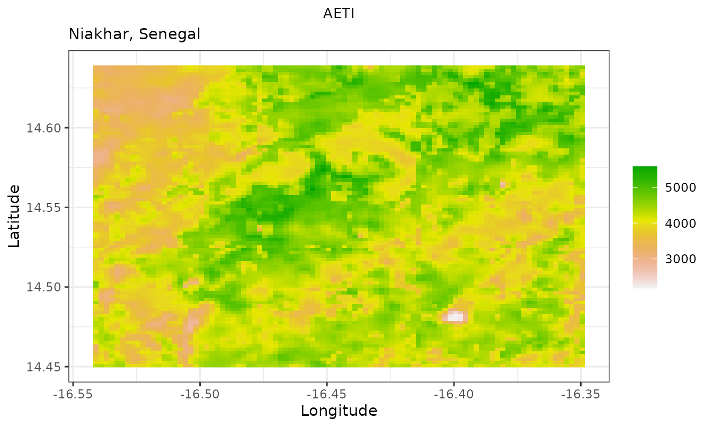
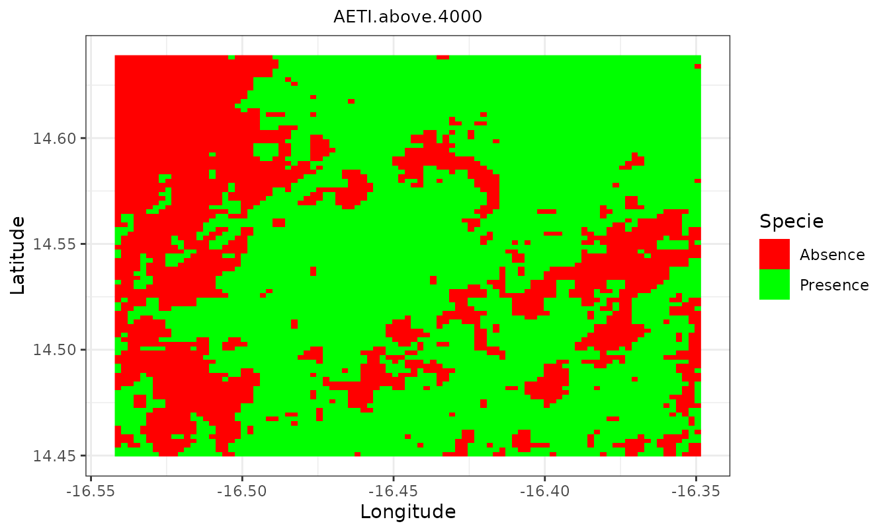
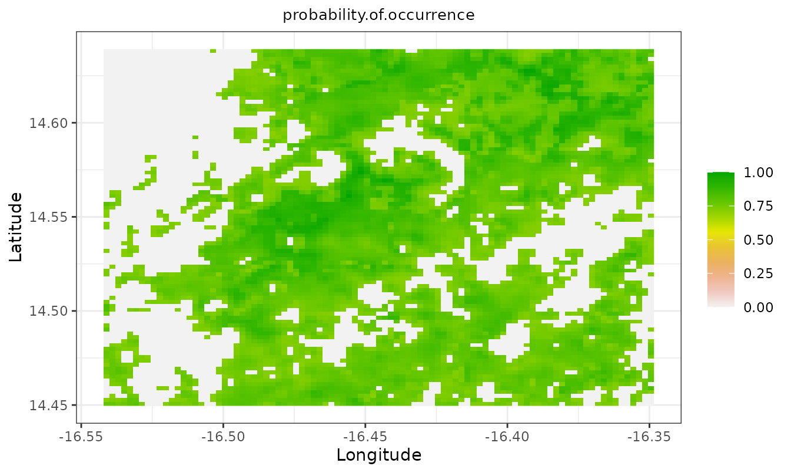

# Getting started with sdmApp

## Introduction

`sdmApp` is an R package containing a Shiny application that lets
non-expert R users model species distribution. It brings a reproducible
workflow for species distribution modeling into a single, user friendly
environment. `sdmApp` takes raster data (in any format supported by the
`raster` package) and species occurrence data (several formats
supported) as input, and provides an interactive graphical user
interface (GUI).

This vignette has two parts. The first shows the small set of mapping
helpers that `sdmApp` exports, using the example data bundled with the
package, so that you can reproduce every figure below on your own
machine. The second describes the graphical interface and the data it
expects.

The main features of the GUI are:

- uploading data (raster predictors and species occurrence files);
- viewing the correlation between raster predictors;
- using [CENFA](https://github.com/rinnan/CENFA) to select species
  predictors;
- applying spatial blocking for cross-validation, based on the
  [blockCV](https://CRAN.R-project.org/package=blockCV) package;
- fitting species distribution models with or without a spatial blocking
  strategy;
- exporting results;
- staying reproducible by downloading the underlying R code.

The GUI is built around five main windows, selectable from the
navigation bar at the top of the screen. Some of these windows start
empty and fill in once raster and species occurrence data have been
uploaded.

## Installation

`sdmApp` is not currently on CRAN, so install it from GitHub. `CENFA` is
also off CRAN and must be installed first.

``` r

# install.packages("remotes")
remotes::install_github("rinnan/CENFA")
remotes::install_github("Abson-dev/sdmApp", dependencies = TRUE)
```

To use the MaxEnt model you additionally need a Java JDK (\>= 8), the
`rJava` package, and the `maxent.jar` file placed in the `java`
directory of the `dismo` package, which you can locate with:

``` r

system.file("java", package = "dismo")
```

Everything shown in this vignette works without Java.

``` r

library(sdmApp)
```

## Launching the interface

A single call starts the application in your browser:

``` r

sdmApp()
```

[`sdmApp()`](https://abson-dev.github.io/sdmApp/reference/sdmApp.md)
accepts a few arguments. `maxRequestSize` sets the largest upload
accepted, in megabytes. `theme` selects the style sheet, one of `"IHSN"`
(the default), `"yeti"`, `"journal"` or `"flatly"`. Setting
`shiny.server = TRUE` returns the application as an object rather than
launching it, which is what you want when deploying behind shiny-server.

``` r

# accept uploads up to 200 MB and use the flatly theme
sdmApp(maxRequestSize = 200, theme = "flatly")

# return the app object instead of running it
app <- sdmApp(shiny.server = TRUE)
```

Before starting,
[`sdmApp()`](https://abson-dev.github.io/sdmApp/reference/sdmApp.md)
checks that the modelling engines it relies on are installed, and stops
with a message naming any that are missing. This avoids a cryptic
failure halfway through a session.

## The bundled example data

The package ships a small extract of the Niakhar study area in Senegal.

### Occurrence data

`Niakhar.csv` holds 9258 georeferenced trees scored for three species,
*Faidherbia albida*, *Balanites aegyptiaca* and *Anogeissus leiocarpus*
(Ndao et al., 2019). The same table is also provided as `.xlsx`, `.dta`,
`.sav` and `.sas7bdat` so that you can practise uploading each format
through the GUI.

The file is semicolon separated and uses a comma as decimal mark, so it
must be read with
[`read.csv2()`](https://rdrr.io/r/utils/read.table.html) rather than
[`read.csv()`](https://rdrr.io/r/utils/read.table.html).

``` r

occ_file <- system.file("extdata", "Niakhar.csv", package = "sdmApp")
occ <- utils::read.csv2(occ_file)

str(occ)
#> 'data.frame':    9258 obs. of  5 variables:
#>  $ X_WGS84              : num  -16.4 -16.4 -16.4 -16.4 -16.4 ...
#>  $ Y_WGS84              : num  14.6 14.6 14.6 14.6 14.6 ...
#>  $ Faidherbia.albida    : int  1 1 1 1 1 1 1 0 0 0 ...
#>  $ Balanites.aegyptiaca : int  0 0 0 0 0 0 0 0 0 1 ...
#>  $ Anogeissus.leiocarpus: int  0 0 0 0 0 0 0 0 0 0 ...
```

The first two columns are longitude and latitude in WGS 84. The
remaining three are binary presence indicators, one per species.

``` r

colSums(occ[, 3:5])
#>     Faidherbia.albida  Balanites.aegyptiaca Anogeissus.leiocarpus 
#>                  3872                  1017                   810
```

For any spatial work, turn the table into an `sf` object. The bundled
rasters are in geographic coordinates, so no reprojection is needed.

``` r

pa_data <- sf::st_as_sf(occ, coords = c("X_WGS84", "Y_WGS84"), crs = 4326)
pa_data[1:3, ]
#> Simple feature collection with 3 features and 3 fields
#> Geometry type: POINT
#> Dimension:     XY
#> Bounding box:  xmin: -16.36178 ymin: 14.6336 xmax: -16.36167 ymax: 14.63375
#> Geodetic CRS:  WGS 84
#>   Faidherbia.albida Balanites.aegyptiaca Anogeissus.leiocarpus
#> 1                 1                    0                     0
#> 2                 1                    0                     0
#> 3                 1                    0                     0
#>                     geometry
#> 1  POINT (-16.36169 14.6336)
#> 2 POINT (-16.36178 14.63363)
#> 3 POINT (-16.36167 14.63375)
```

### Environmental variables

The package bundles 34 raster predictors relating to **bioclimatic
drivers**, **soil properties**, **water productivity**, **vegetation
phenology and productivity** and **watershed topography**. In the
original study the predictors were set on a common projection (WGS 84,
UTM zone 28N), cropped to a common extent and resampled to a common
resolution of 250 m. The extract distributed with the package is aligned
on a common grid of 93 by 91 cells in geographic coordinates
(EPSG:4326).

``` r

files <- list.files(
  system.file("extdata", package = "sdmApp"),
  pattern = "\\.tif$", full.names = FALSE
)
length(files)
#> [1] 34
head(files, 10)
#>  [1] "AETI.tif"  "bio1.tif"  "bio10.tif" "bio11.tif" "bio12.tif" "bio13.tif"
#>  [7] "bio15.tif" "bio16.tif" "bio17.tif" "bio18.tif"
```

Load one of them, the actual evapotranspiration and interception layer:

``` r

r <- raster::raster(system.file("extdata", "AETI.tif", package = "sdmApp"))
r
#> class      : RasterLayer 
#> dimensions : 91, 93, 8463  (nrow, ncol, ncell)
#> resolution : 0.002083333, 0.002083333  (x, y)
#> extent     : -16.54214, -16.34839, 14.44958, 14.63916  (xmin, xmax, ymin, ymax)
#> crs        : +proj=longlat +datum=WGS84 +no_defs 
#> source     : AETI.tif 
#> names      : AETI 
#> values     : 2182.308, 5578.13  (min, max)
```

#### Bioclimatic variables

Bioclimatic variables are derived from monthly temperature and rainfall
values to produce more biologically meaningful predictors. They capture
annual trends (mean annual temperature, annual precipitation),
seasonality (annual range in temperature and precipitation) and extreme
or limiting factors (temperature of the coldest and warmest month,
precipitation of the wettest and driest quarters). They were extracted
from the WorldClim database version 2 and are averages for the years
1970 to 2000 (Fick and Hijmans, 2017).

#### Soil properties

Seven soil property variables come from the ISRIC World Soil Information
portal, produced by the Africa Soil Information Service (AfSIS) project.
More than 85 thousand samples, from over 28 thousand sampling locations
and covering 1950 to 2012, were used for the spatial predictions (Hengl
et al., 2015).

#### Water productivity

Two water productivity variables were retrieved from the FAO WaPOR
database. Net biomass water productivity (NBWP) expresses total biomass
production in relation to the volume of water beneficially consumed
through canopy transpiration over the year, net of soil evaporation.
Actual evapotranspiration and interception (AETI) is the sum of soil
evaporation, canopy transpiration and interception, that is the rainfall
intercepted by leaves and evaporated directly from their surface (FAO,
2020). Both are agrometeorological variables useful for monitoring how
effectively vegetation converts water into biomass (NBWP) and for
analysing the soil-air interface and plant functioning (AETI).

#### Vegetation phenology and productivity

Agroforestry systems are landscapes shaped by interactions between
crops, trees and cropping practices. Two phenological metrics related to
the cropping season were therefore included, derived from 16-day MODIS
NDVI time series (MOD13Q1) using the TIMESAT software (Eklundh and
Jonsson, 2011).

#### Watershed topography

Topographic variables were derived with the Soil and Water Assessment
Tool (SWAT) from the 30 m NASA SRTM digital elevation model. The SWAT
watershed delineator was used to extract 69 sub-basins within the study
area, in a vector file whose attribute table carries the topographic
variable values (Winchell et al., 2010).

## Working with the exported functions

`sdmApp` exports four functions besides the launcher. They are
deliberately small: each takes a raster (or a set of folds) and returns
a `ggplot` object that you can further customise with the usual
`ggplot2` grammar.

### Plotting a continuous raster

[`sdmApp_RasterPlot()`](https://abson-dev.github.io/sdmApp/reference/sdmApp_RasterPlot.md)
samples the layer on a regular grid, so it stays fast on large rasters,
and draws it with a terrain colour ramp.

``` r

sdmApp_RasterPlot(r)
```



Because the result is an ordinary `ggplot` object, you can adjust it:

``` r

sdmApp_RasterPlot(r) +
  ggplot2::labs(subtitle = "Niakhar, Senegal")
```



### Plotting a presence/absence surface

[`sdmApp_PA()`](https://abson-dev.github.io/sdmApp/reference/sdmApp_PA.md)
expects a binary raster and maps absence in red and presence in green.
Here we threshold the AETI layer to build one.

``` r

pa <- r > 4000
names(pa) <- "AETI above 4000"

sdmApp_PA(pa)
```



### Masking a probability surface

A species distribution model produces a probability of occurrence
surface.
[`sdmApp_TimesRasters()`](https://abson-dev.github.io/sdmApp/reference/sdmApp_TimesRasters.md)
multiplies it by a presence/absence surface, so that only the cells
predicted as presence keep their probability. The name of the first
raster is carried over to the result.

``` r

prob <- r / raster::cellStats(r, "max")
names(prob) <- "probability of occurrence"

masked <- sdmApp_TimesRasters(prob, pa)
names(masked)
#> [1] "probability.of.occurrence"

sdmApp_RasterPlot(masked)
```



Every exported function validates its inputs, so a mistake fails early
and with a readable message rather than deep inside `ggplot2`:

``` r

sdmApp_TimesRasters(1, 2)
#> Error:
#> ! 'x' and 'y' must both be Raster* objects.
```

### Exploring spatial cross-validation folds

Random splits of spatially structured data give over-optimistic error
estimates (Telford and Birks, 2009; Roberts et al., 2017). `sdmApp`
relies on `blockCV` to build spatially separated folds, and
[`sdmApp_fold_Explorer()`](https://abson-dev.github.io/sdmApp/reference/sdmApp_fold_Explorer.md)
draws the training and testing points of a chosen fold on top of a
background raster.

``` r

library(blockCV)

sb <- spatialBlock(
  speciesData = pa_data["Faidherbia.albida"],
  species = "Faidherbia.albida",
  rasterLayer = r,
  theRange = 2000,
  k = 5,
  selection = "random",
  iteration = 100
)

sdmApp_fold_Explorer(sb, r, pa_data["Faidherbia.albida"], num = 1)
```

Note a compatibility caveat. From `blockCV` version 3.0,
[`spatialBlock()`](https://rdrr.io/pkg/blockCV/man/spatialBlock.html) is
deprecated in favour of
[`cv_spatial()`](https://rdrr.io/pkg/blockCV/man/cv_spatial.html), and
the object returned by
[`cv_spatial()`](https://rdrr.io/pkg/blockCV/man/cv_spatial.html) is no
longer of class `SpatialBlock`.
[`sdmApp_fold_Explorer()`](https://abson-dev.github.io/sdmApp/reference/sdmApp_fold_Explorer.md)
currently tests for that class, so it works with the deprecated
[`spatialBlock()`](https://rdrr.io/pkg/blockCV/man/spatialBlock.html)
but not yet with
[`cv_spatial()`](https://rdrr.io/pkg/blockCV/man/cv_spatial.html).
Support for the new class is planned.

## A typical session in the GUI

The navigation bar exposes five tabs, which are meant to be visited in
order.

1.  **Help/About** gives a short description of the application and of
    the modelling options.
2.  **Data Upload** takes the raster predictors and the species
    occurrence file. Occurrence data can be supplied as CSV, Excel,
    Stata, SPSS or SAS. Nothing else in the interface is populated until
    this step succeeds.
3.  **Spatial Analysis** covers predictor screening. You can inspect the
    correlation matrix between predictors, run an ecological niche
    factor analysis with `CENFA` to rank predictors by their
    contribution to marginality and specialisation, estimate the range
    of spatial autocorrelation, and build spatial blocks for
    cross-validation.
4.  **Modeling** fits the models. Bioclim, Domain, Mahalanobis, GLM,
    MaxEnt, random forest and support vector machines are available,
    with or without a spatial blocking strategy, and results can be
    exported as rasters and tables.
5.  **R-Code** returns the R code corresponding to the session, so the
    analysis can be rerun, version controlled and shared.

A reasonable workflow is therefore: upload, drop strongly correlated
predictors, select predictors with `CENFA`, choose a block size informed
by the spatial autocorrelation range, generate folds, fit one or more
models, compare them, then export both the maps and the R code.

## Session information

``` r

sessionInfo()
#> R version 4.6.1 (2026-06-24)
#> Platform: x86_64-pc-linux-gnu
#> Running under: Ubuntu 24.04.4 LTS
#> 
#> Matrix products: default
#> BLAS:   /usr/lib/x86_64-linux-gnu/openblas-pthread/libblas.so.3 
#> LAPACK: /usr/lib/x86_64-linux-gnu/openblas-pthread/libopenblasp-r0.3.26.so;  LAPACK version 3.12.0
#> 
#> locale:
#>  [1] LC_CTYPE=C.UTF-8       LC_NUMERIC=C           LC_TIME=C.UTF-8       
#>  [4] LC_COLLATE=C.UTF-8     LC_MONETARY=C.UTF-8    LC_MESSAGES=C.UTF-8   
#>  [7] LC_PAPER=C.UTF-8       LC_NAME=C              LC_ADDRESS=C          
#> [10] LC_TELEPHONE=C         LC_MEASUREMENT=C.UTF-8 LC_IDENTIFICATION=C   
#> 
#> time zone: UTC
#> tzcode source: system (glibc)
#> 
#> attached base packages:
#> [1] stats     graphics  grDevices utils     datasets  methods   base     
#> 
#> other attached packages:
#> [1] sdmApp_0.0.3
#> 
#> loaded via a namespace (and not attached):
#>  [1] sass_0.4.10        generics_0.1.4     class_7.3-23       KernSmooth_2.23-26
#>  [5] lattice_0.22-9     digest_0.6.39      magrittr_2.0.5     evaluate_1.0.5    
#>  [9] grid_4.6.1         RColorBrewer_1.1-3 fastmap_1.2.0      jsonlite_2.0.0    
#> [13] e1071_1.7-17       DBI_1.3.0          promises_1.5.0     scales_1.4.0      
#> [17] codetools_0.2-20   textshaping_1.0.5  jquerylib_0.1.4    shiny_1.14.0      
#> [21] cli_3.6.6          rlang_1.3.0        units_1.0-1        cowplot_1.2.0     
#> [25] withr_3.0.3        cachem_1.1.0       yaml_2.3.12        otel_0.2.0        
#> [29] tools_4.6.1        raster_3.6-32      dplyr_1.2.1        ggplot2_4.0.3     
#> [33] httpuv_1.6.17      mime_0.13          vctrs_0.7.3        R6_2.6.1          
#> [37] proxy_0.4-29       lifecycle_1.0.5    classInt_0.4-11    fs_2.1.0          
#> [41] htmlwidgets_1.6.4  ragg_1.5.2         pkgconfig_2.0.3    desc_1.4.3        
#> [45] later_1.4.8        pkgdown_2.2.1      terra_1.9-34       pillar_1.11.1     
#> [49] bslib_0.11.0       gtable_0.3.6       glue_1.8.1         Rcpp_1.1.2        
#> [53] sf_1.1-1           systemfonts_1.3.2  xfun_0.60          tibble_3.3.1      
#> [57] tidyselect_1.2.1   knitr_1.51         xtable_1.8-8       farver_2.1.2      
#> [61] htmltools_0.5.9    labeling_0.4.3     rmarkdown_2.31     compiler_4.6.1    
#> [65] S7_0.2.2           sp_2.2-1
```

## References

Bahn, V., McGill, B.J. (2012). Testing the predictive performance of
distribution models. *Oikos*, 122(3), 321-331.

Eklundh, L., Jonsson, P. (2011). *TIMESAT 3.0 Software Manual*. Lund
University, Sweden.

FAO (2020). *WaPOR database methodology*. Food and Agriculture
Organization of the United Nations, Rome.

Fick, S.E., Hijmans, R.J. (2017). WorldClim 2: new 1 km spatial
resolution climate surfaces for global land areas. *International
Journal of Climatology*, 37(12), 4302-4315.

Hastie, T., Tibshirani, R., Friedman, J. (2009). *The Elements of
Statistical Learning: Data Mining, Inference, and Prediction*, 2nd
edition. Springer, New York.

Hengl, T., Heuvelink, G.B.M., Kempen, B., et al. (2015). Mapping soil
properties of Africa at 250 m resolution: random forests significantly
improve current predictions. *PLoS ONE*, 10(6), e0125814.

Hiemstra, P.H., Pebesma, E.J., Twenhofel, C.J., Heuvelink, G.B. (2009).
Real-time automatic interpolation of ambient gamma dose rates from the
Dutch radioactivity monitoring network. *Computers and Geosciences*,
35(8), 1711-1721.

Ndao, B., Leroux, L., Diouf, A.A., Soti, V., Sambou, B. (2019). A remote
sensing based approach for optimizing sampling strategies in crop
monitoring and crop yield estimation studies. In: Wade, S. (Ed.), *Earth
Observations and Geospatial Science in Service of Sustainable
Development Goals*. Springer, pp. 25-36.
[doi:10.1007/978-3-030-16016-6_3](https://doi.org/10.1007/978-3-030-16016-6_3)

O’Sullivan, D., Unwin, D.J. (2010). *Geographic Information Analysis*,
2nd edition. John Wiley and Sons.

Phillips, S.J., Anderson, R.P., Dudik, M., Schapire, R.E., Blair, M.E.
(2017). Opening the black box: an open-source release of Maxent.
*Ecography*, 40(7), 887-893.

Rinnan, D.S., Lawler, J. (2019). Climate-niche factor analysis: a
spatial approach to quantifying species vulnerability to climate change.
*Ecography*, 42, 1494-1503.
[doi:10.1111/ecog.03937](https://doi.org/10.1111/ecog.03937)

Roberts, D.R., Bahn, V., Ciuti, S., et al. (2017). Cross-validation
strategies for data with temporal, spatial, hierarchical, or
phylogenetic structure. *Ecography*, 40(8), 913-929.

Telford, R.J., Birks, H.J.B. (2009). Evaluation of transfer functions in
spatially structured environments. *Quaternary Science Reviews*, 28(13),
1309-1316.

Valavi, R., Elith, J., Lahoz-Monfort, J.J., Guillera-Arroita, G. (2019).
blockCV: An R package for generating spatially or environmentally
separated folds for k-fold cross-validation of species distribution
models. *Methods in Ecology and Evolution*, 10, 225-232.
[doi:10.1111/2041-210X.13107](https://doi.org/10.1111/2041-210X.13107)

Winchell, M., Srinivasan, R., Di Luzio, M., Arnold, J. (2010). *ArcSWAT
Interface for SWAT2009: User’s Guide*. Texas Agricultural Experiment
Station, Texas.
